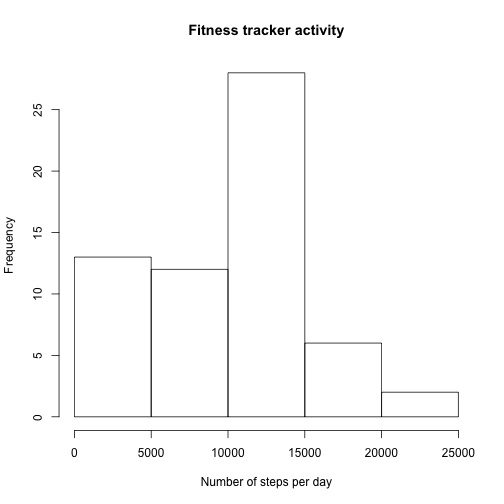
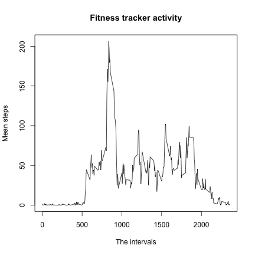
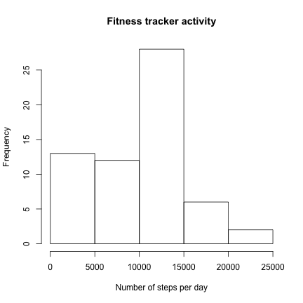
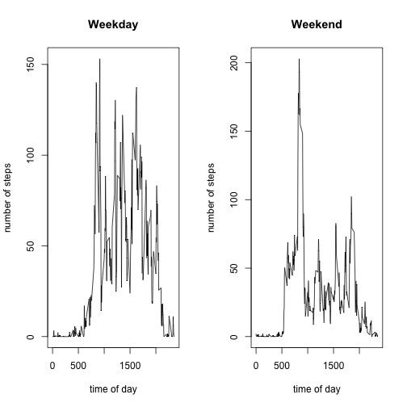

Reproducible Research
========================
Loading and preprocessing the data

```r
setwd("~/Desktop/workinprogress")
mydata<-read.csv("activity.csv",header=TRUE,sep=",")
truedata<-split(mydata$steps,mydata$date)
histdata<-lapply(truedata,sum,na.rm=TRUE)
mean1<-lapply(truedata,sum,na.rm=TRUE)
histdata1<-lapply(truedata,sum,na.rm=TRUE)
con<-as.matrix(histdata)
con1<-as.numeric(con,na.rm=TRUE)
```
Histogram of the total number of steps taken each day 

```r
hist(con1,xlab="Number of steps per day",main="Fitness tracker activity")
```




```r
## "The mean and median"
count10=0
sum=0
for(u in mean1)
{sum=sum+u
count10=count10+1}
print(sum/count10)
```

```
## [1] 9354.23
```

```r
print(median(sort(as.numeric(histdata1))))
```

```
## [1] 10395
```
Time series plot of the average number of steps

```r
a<-split(mydata$steps,mydata$interval)
b<-lapply(a,mean,na.rm=TRUE)
c<-as.matrix(b,na.rm=TRUE)
d<-as.numeric(c,na.rm=TRUE)
```
The plot

```r
plot(names(a),c[,1],type="l",xlab="The intervals",ylab="Mean steps",main="Fitness tracker activity")
```




```r
## "The maximum number of steps in the interval"
min<-0
for (r in names(a))
{
        t=unlist(b[r])
        if(t>min)
        {
                min<-t;
                max<-r;
        }
}
```
The values and the interval

```r
print(min)
```

```
##      835 
## 206.1698
```

```r
print(max)
```

```
## [1] "835"
```
Imputing the missing data
This is done by subsituting the NA values with the mean value at the interval and 0's when the mean doesn't exist

```r
count=1
histdata<-lapply(truedata,mean,na.rm=TRUE)
con<-as.matrix(histdata)
while(count-1<dim(mydata)[1])
{
        if(is.na(mydata[count,"steps"]))
        {
                g<-b[mydata[count,"interval"]]
                g<-unlist(g)
                if(is.null(g))
                {
                        w=0;
                }
                if(!is.null(g))
                {
                        w=g;
                }
                mydata[count,"steps"]=0
        }
        count=count+1
}
truedata<-split(mydata$steps,mydata$date)
histdata<-lapply(truedata,sum,na.rm=TRUE)
mean1<-lapply(truedata,mean,na.rm=TRUE)
histdata1<-lapply(truedata,median,na.rm=TRUE)
con<-as.matrix(histdata)
con1<-as.numeric(con,na.rm=TRUE)
```
Missing Values

```r
def<-mydata$steps
print(length(def[is.na(def)]))
```

```
## [1] 0
```
The histogram after the imputing of the data

```r
hist(con1,xlab="Number of steps per day",main="Fitness tracker activity")
```




```r
## "Plotting data for weekdays and weekends"
t<-as.Date(mydata$date,"%Y-%m-%d")
s<-weekdays(t)
w=s=="Sunday" | s=="Saturday"
mydata["weekday"]=w
truedata<-split(mydata$steps,mydata$weekday)
truedata1<-split(mydata$interval,mydata$weekday)
a1<-split(mydata,mydata$weekday)
a100<-split(a1[["FALSE"]]$"steps",a1[["FALSE"]]$"interval")
b<-lapply(a100,mean,na.rm=TRUE)
c100<-as.matrix(b,na.rm=TRUE)
a1<-split(mydata,mydata$weekday)
a<-split(a1[["TRUE"]]$"steps",a1[["TRUE"]]$"interval")
b<-lapply(a,mean,na.rm=TRUE)
c<-as.matrix(b,na.rm=TRUE)
d<-as.numeric(c,na.rm=TRUE)
```
The plot

```r
par(mfcol=c(1,2))
plot(names(a),c[,1],type="l",xlab="time of day",ylab="number of steps",main="Weekday")
plot(names(a100),c100[,1],type="l",xlab="time of day",ylab="number of steps",main="Weekend")
```


